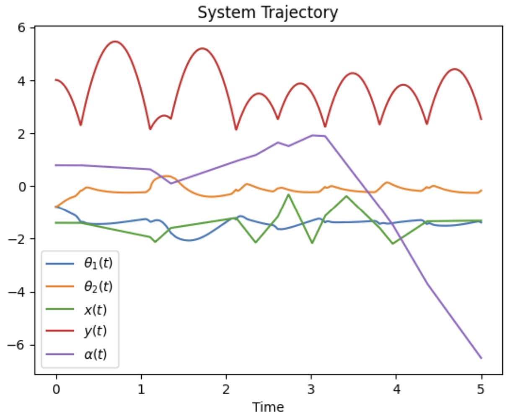
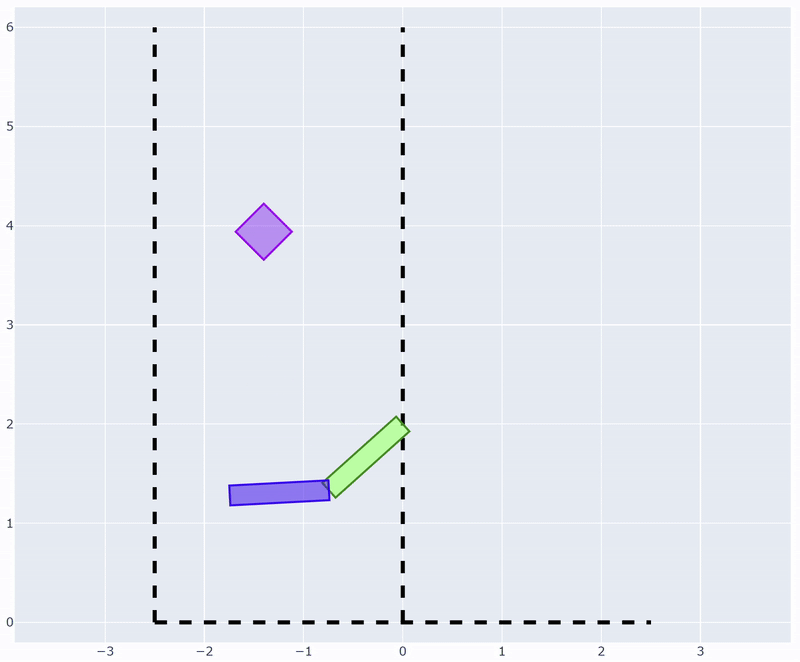

## Lagrangian Dynamics + PD Control Soccer Juggling Simulation
**Author: Jared Berry**

This project was associated with Northwestern University ME 314: Theory of Machines - Dynamics (Fall 2024).

## Introduction
#### Objective and Project Description
I've always loved soccer, and have been playing since I was a child. When I was younger I used to play a juggling game, in which I would practice juggling the soccer ball against my garage door, trying to keep it from touching the ground. The goal of this project was to create a physically reasonable representation of soccer juggling with Lagrangian dynamics, while also tying in ideas from my interests in robotics and control systems.

My system consists of 2 walls (left and right), a floor, a leg (represented as an actuated double pendulum) and a ball (represented by a cube). There are 5 state variables: the 2 pendulum angles, and the coordinates of the cube as well as its rotation. Planar gravity is acting on all objects in the system, with the double pendulum and cube also having planar rotational inertia.

#### Process Outline
All code is in an IPython Notebook, and organized into sections.

1. Define system parameters and inertia matrices.
2. Create helper functions for manipulating SE3 matrices (inverse, skew-symmetric, derivatives, conversion to 6-dimensional twist).
3. Calculate all necessary frame transformations.
4. Compute the system's kinetic energy, potential energy, and Lagrangian.
5. Define all 20 potential impacts, and create impact equations.
6. Create PD controller and custom conditional force equation.
7. Evaluate forced Euler-Lagrange equations.
8. Create numerical impact update, simulation, and integration functions.
9. Simulate and plot system trajectory.
10. Animate system with custom animation function.

## Results
My dynamics simulation is a physcially reasonable depiction of soccer juggling. Below is the final version of a plot I used during development to determine the success of my simulation. It displays the dynamics of all state variables, and their adherence to their respective impact constraints.

Below is an animation created with my custom animation function.

